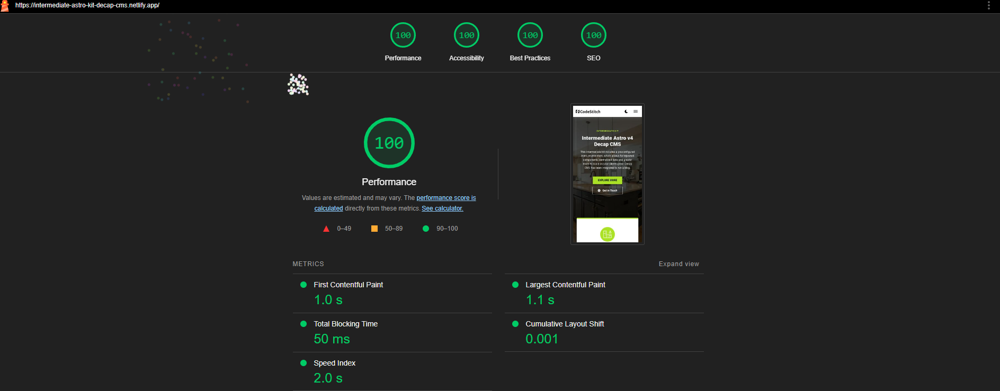

  <h3 align="center">Intermediate Astro v4 - Decap CMS</h3>

  <p align="center">
    This intermediate kit includes a pre-configured Astro setup, along with five pages filled with CodeStitch components. Everything is ready to go right from the start, offering a fantastic introduction to the advantages of a Static Site Generator, complete with LESS preprocessing and a blog powered by Decap CMS. This kit also leverages the power of a few Astro tools such as, but not limited to, Content Collections, View Transitions, Astro components, scoped styling and scripting etc.
    <br/>
    <br/>
    <a href="https://intermediate-astro-kit-decap-cms.netlify.app" target="_blank">View Live Result</a>
  </p>

  <p align="center">
    Created and maintained by <a href="https://github.com/BuckyBuck135" target="_blank">BuckyBuck135</a>
  </p>

## Table of Contents

- [Overview](#overview)
- [Getting Started](#gettingStarted)
- [Prerequisites](#prerequisites)
- [Features](#features)
- [Project Structure](#projectStructure)
  - [Project Tree](#projectTree)
  - [Root Files and Folders](#rootFilesAndFolders)
- [Expanding the Project](#expandingTheProject)
  - [Reusing Code](#reusingCode)
  - [Scripts and Event Handling](#scripts)
  - [Adding More Pages](#addingMorePages)
  - [Navigation via navData.json](#navigationViaFrontMatter)
  - [Built-in Astro components](#builtinastrocomponents)
  - [Custom Picture component](#Custompicturecomponent)
  - [Configuring the CMS](#configuringTheCms)
  - [Astro Content Collections](#AstroContentCollections)
  - [Preloading images](#preloadingimages)
  - [Sitemap Configuration](#sitemapConfiguration)
- [Deployment](#deployment)
- [Acknowledgments](#acknowledgments)
- [Conclusion](#conclusion)

<a name="overview"></a>

## Overview

This intermediate kit includes a pre-configured <a href="https://www.astro.build">Astro</a> environment, which
allows for repeated components, centralized data and greater room to scale as your clients grow. The kit runs the latest major Astro version, v4. On top of this, a blog has been provided through [Decap CMS](https://decapcms.org/) to allow your clients to manage their content on their own. This can easily be adapted to anything which requires changing content, such as menus, job listing boards, portfolios and much more.

An example website has also been provided, with easy substitution of website sections possible through the use of <a href="https://codestitch.app/">CodeStitch's
vanilla component library</a>. This kit aims to get any project off the ground in as little time as possible, with deployment being possible in as little as two minutes. We recommend Netlify as a host to take advantage of Netlify Identity and client authentication to the CMS dashboard.


<a name="gettingStarted"></a>

## Getting Started

1. At the top right of the GitHub Repository, click the green _Use this template_ button,
   then click _Create a new repository_.
2. Follow the instructions to create a new repository, using this repo as a template.
3. When created, clone the repository to your local machine.
4. Run `npm install` to install all dependencies.
5. Run `npm run dev` to start the project and spin up a development server on `localhost:4321` and a Decap admin server. Access the admin dashboard at the `/admin` path.

Next, it is recommended to update `data/client.json` with some new information about this project. Through the power of templating, the
project's `<head>` and contact information will automatically be filled out, providing a first peek into some of the benefits of SSGs.

You can find all of CodeStitches `:root` variables, as well as .cs-topper, .cs-title and .cs-text, within the `root` stylesheet. Feel free to adjust these, or use our Content Flair micro-stitches, to update site-wide styles quickly.


<a name="prerequisites"></a>

## Prerequisites

Only the vanilla web technologies are _required_ before using this kit, with some familiarity with Astro and React-style Components and props also recommended, but not essential. A lot of the leg-work for the non-vanilla technologies has been done for you. If you would like to read up on some of these things, we recommend the following resources:

1. [Astro's Documentation](https://docs.astro.build/en/getting-started/)
2. [Astro Crash Course in 20 Minutes!](https://www.youtube.com/watch?v=zrPVTf761OI)
3. [Decap CMS' docs](https://decapcms.org/docs/intro/) can also be found should you wish to extend the CMS beyond what's in this kit


<a name="features"></a>

## Features

* Runs on Astro v4
* Decap CMS integration with a blog ready to go. Give access to your client via Netlify Identity to allow them to write blog posts. Their edits will be pushed to the repository, triggering a re-build automatically.
* Astro's View Transitions integration
* Components, props and scoped styles, as demonstrated in `/src/components/Landing.astro` for example
* Astro's built-in components such as `<Picture />`, as demonstrated in `/src/components/Landing.astro` for example
* Astro's content collections, leveraging image validation. This allows the use of Astro components on user-uploaded images via the CMS, automatically converting your images to modern `.webp` or `.avif` format.
* Accessible dropdown menus on desktop navigation and nested pages
* [CodeStitch](https://codestitch.app/) HTML and CSS blocks to build the UI.
* Perfect Lighthouse scores
  


This kit ships the following packages:
* [Astro Icon](https://www.astroicon.dev/) - Astro Icon is a straightforward icon system for the Astro framework.
* [Autoprefixer](https://www.npmjs.com/package/autoprefixer) - PostCSS plugin to parse CSS and add vendor prefixes to CSS rules using values from Can I Use. It is recommended by Google and used in Twitter and Alibaba.
* [LESS](https://www.npmjs.com/package/less) - Less makes a few convenient additions to the CSS language, but you can also simply write standard CSS if you wish.

<a name="projectStructure"></a>

## Project Structure

Astro leverages an opinionated folder layout for your project. Every Astro project root should include the following directories and files:
* `src/*` - Your project source code (components, pages, styles, etc.)
* `public/*` - Your non-code, unprocessed assets (fonts, icons, etc.)
* `package.json` - A project manifest.
* `astro.config.mjs` - An Astro configuration file. (recommended)
* `tsconfig.json` - A TypeScript configuration file. (recommended)

<a name="projectTree"></a>

### Project Tree

```
.
├── public/
│   ├── admin/
|   |   └── config.yml
|   |—— assets/
|   |   |—— favicons/
|   |   |—— fonts/
|   |   |—— images/
|   |   └── svgs/
|   |—— _redirects
|   |—— robots.txt
├── src/
|   ├── assets/
|   |   └—— images/
|   |       └── blog/
|   ├── components/
|   ├── content/
|   |   |—— config.ts
|   |   └── blog/
│   ├── _data/
│   │   ├── client.json
│   │   └── navData.json
│   ├── icons/
│   ├── layouts/
│   │   └── BaseLayout.astro
|   ├── js/
│   │   ├── nav.js
|   |   └── utils.js
│   ├── pages/
|   |   └── blog/
|   |   └── projects/
|   └── styles/
├── astro.config.mjs
├── postcss.config.cjs
├── package-lock.json
├── package.json
└── tsconfig.json
```

<a name="rootFilesAndFolders"></a>

### Root Files and Folders


#### `public/*`
The `public/` directory is for files and assets in your project that do not need to be processed during Astro’s build process. The files in this folder will be copied into the build folder untouched, and then your site will be built.

This behavior makes `public/` ideal for common assets like images and fonts, or special files such as`_redirects` and `robots.txt`.

- \_redirects - To configure redirects. Read more on <a href="https://docs.netlify.com/routing/redirects/">Netlify</a>
- content/ - Data to render pages from, such as the blog.
- robots.txt - Instructions for site crawlers. Learn more, and generate your own, <a href="https://en.ryte.com/free-tools/robots-txt-generator/">here</a>

You can place CSS and JavaScript in your public/ directory, but be aware that those files will not be bundled or optimized in your final build.

##### `public/admin`
This folder contains `config/yml`, which is where Decap CMS configuration options lives. [More information about options in Decap docs](https://decapcms.org/docs/configuration-options/)

#### `src/*`
The `src/` folder is where most of your project source code lives. This includes:

* Pages
* Layouts
* Astro components
* UI framework components (React, etc.)
* Styles (CSS, Sass)
* Markdown

Astro processes, optimizes, and bundles your src/ files to create the final website that is shipped to the browser. Unlike the static public/ directory, your src/ files are built and handled for you by Astro.

##### `src/assets`
Contains all assets you want optimized by Astro (such as assets used in `<Picture />` components for example) must be placed in `src`.

`public/assets/images/blog` is where the images uploaded on the CMS will be stored.

##### `src/components`
Components are reusable units of code for your HTML pages. These could be Astro components, or UI framework components like React or Vue. It is common to group and organize all of your project components together in this folder.

##### `src/content`
The src/content/ directory is reserved to store content collections organised in folders (e.g. `src/content/blog`) containing `.md` files, and an optional `config.ts` collections configuration file. No other files are allowed inside this folder.

##### `src/data`
This directory contains data files that are accessible within any template throughout the project. 
* `client.js` holds some information you may wish to define for a client. It's important to fill this file out with the correct information for your client, as many HTML meta tags, the sitemap, and robots.txt all use data from this file.

* `navData.json` holds data to create the navigation of your site. See more information in the [navigation via navData.json section](#navigationViaFrontMatter)

##### `src/icons`
SVGs used by the <Icon /> component **must** be placed in this folder.

##### `src/layouts`
Layouts are Astro components that define the UI structure shared by one or more pages. The `BaseLayout.astro` file acts as a giant wrapper for each individual page, where the content is injected through the `<slot /> `component.

##### `src/js`
Contains helper functions.

##### `src/pages`
Pages are a special kind of component used to create new pages on your site. A page can be an Astro component, or a Markdown file that represents some page of content for your site.

##### `src/styles`
It is a common convention to store your CSS, Less or Sass files in a `src/styles` directory.


#### `package.json` and `package-lock.json`
The project's manifest. Standard NodeJS package files, containing the dependencies needed for the project to work.

#### `node_modules/*`
Created after you run `npm install`. This directory contains the code for all the dependencies that power this kit. It comes as standard with any NodeJS-powered project, much like the `package.json` and `package-lock.json` files. You can safely ignore this directory in your day-to-day work.

#### `dist/`
Created after running `npm build`. This will hold the final build of your site.

#### `astro.config.mjs`
An Astro configuration file. It's already set up for you, but you can extend it with integrations to use, build options, server options, and more.

#### `tsconfig.json`
A TypeScript configuration file. Optional. Includes TypeScript configuration options for your Astro project. Some features (like npm package imports) aren’t fully supported in the editor without a tsconfig.json file.

<a name="expandingTheProject"></a>

## Expanding the Project

Aimed towards freelancers, this kit was made with scalability and flexibility in mind, suiting a range of websites and client needs. As such, it is your choice whether you'd rather make small tweaks to the existing site, or clear all the page content and build a site all over again. Outlined below are some best
practices for when it comes to building on top of this kit:

<a name="reusingCode"></a>

### Reusing Code

The main advantage to using an SSG is it brings components, popularized by JavaScript-heavy frameworks like React or Vue, to vanilla HTML. As Astro is being
used, componentization can be achieved through JSX-like syntax within .astro files.

For example, there is a call to action at the bottom of most pages. As the text content or styles don't need to change, `<CTA />` was
used. If this wasn't the case, and we wanted the CTA text to change, we'd start to think about passing props to `<CTA />`.

An example of passing props to components is `Landing />`.

In `about.astro`:

```JS
---
// import the component
import Landing from "@components/Landing.astro";
---

<BaseLayout
  title="About"
  description="Meta description for the page"
  preloadImg="/assets/images/cabinets2.jpg"
>
  // Use the <Landing /> component
  <Landing 
    title="About Us" // pass a `title` prop to the component
  />
```

In `Landing.astro`
```JS
---
const { title } = Astro.props // Destructure the incoming props. Note the `Astrop.props` syntax
---

<h1 id="home-h">{title}</h1> // Consumme the title prop in the JSX markup

```

<a name="scripts"></a>

### Scripts and Event Handling
You can add interactivity to your Astro components using standard HTML `<script>` tags. This allows you to send JavaScript to run in the browser and add functionality to your Astro components.

#### Using `<script>` in Astro

This kit uses scripts in two different ways:
1. Imported from `src/`

Astro will build, optimize, and add these scripts to the page for you.
> `async` and `defer` attributes are unnecessary. Indeed, the processed script will be injected into your page’s <head> with `type="module"` and module scripts are always deferred automatically.

For example, `nav.js` lives in `src/` and is used in `Baselayout.astro` like so: 

`<script src="@js/nav.js"></script>`


2. Scoped to the component

Another way to use scripts in Astro is to use them directly in the component. For example, the `FAQ.astro` component uses a `<script>` tag to toggle the FAQ elements on and off. This script doesn't need to be executed on every page, so it is best scoped to its component.

This being said, this particular script could also well be imported from `src/` as seen above, and it would work too.

#### Using scripts with `<ViewTransitions />` enabled
When you add view transitions to an existing Astro project, some of your scripts may no longer re-run after page navigation like they did with full-page browser refreshes. 

The <ViewTransition /> router fires a number of events on the document during navigation. These events provide hooks into the lifecycle of navigation, allowing you to do things like show indicators that a new page is loading, override default behavior, and restore state as navigation is completing.

In this kit, both the nav and FAQ scripts use the `astro:page-load` wrapper. You can use this event to run code on every page navigation, for example to set up event listeners that would otherwise be lost during navigation.

```js
<script>
  document.addEventListener('astro:page-load', () => {
    // This runs on first page load and after every navigation.
    setupStuff(); // e.g. add event listeners
  });
</script>
```

For an in-depth explanation, please refer <a href="https://docs.astro.build/en/guides/view-transitions/#script-behavior-with-view-transitions">to the documentation.

<a name="addingMorePages"></a>

### Adding More Pages

Thanks to Astro Navigation, adding new pages is as simple as adding a file to src/pages/ and including it in the `data/navData.json` file:

```JSX
---
// optional JavaScript frontmatter
---

<BaseLayout
  title="Page title for <title> and OG tags"
  description="Description for <meta> and OG tags"
>
    <!-- Page HTML goes here, without a <main> wrapper -->
</BaseLayout>
```

Starting from the top, you can see some data enclosed in --- tags. This is known as the page's front matter, which provides additional data to when it comes to
rendering your pages.

To add sub-pages, you will first need to create a new folder under `src/pages/` and populate it with `.astro` pages. Look at the `src/pages/projects` forlder for an example. Don't forget to edit `navData.json` to handle the navigation. The navigation bar is already set up to create drop-down menus.

<a name="navigationViaFrontMatter"></a>

### Navigation via navData.json

The header navigation in the project is powered by the `navData.json` file. Each page in the navigation should be included as an item with a `key` property (page title to be displayed) and a `url` property (include a trailing slash). 

To add subpages, populate the `children` array with page objects (i.e., object containing a `key` and `url` property.) If a page has a populated `children` array, a dropdown will be created, provided that a Navigation + Dropdown Stitch is being used (see below). Navigation links will render in the order they're declared.

If you wish to use an alternative Navigation stitch, you are welcome to swap out the `.cs-ul-wrapper` div in the Stitch for the one used in this starter kit. 
This will allow you to continue to reap the benefits of navigation vi navData.json. If you want to include dropdown menus in your navigation, you can use the `.cs-ul-wrapper` div below

> Note: we have customised this navigation wrapper to include better accessibility features, which you will not find in navigation stitches.

``` JSX
<div class="cs-ul-wrapper">
  <ul id="cs-expanded-ul" class="cs-ul">
    {navData.map((entry) => (
      <li
        class:list={[
          "cs-li",
          { "cs-dropdown": entry.children?.length > 0 },
        ]}
        
      >
        {entry.children?.length > 0 ? (
          // If entry has children in navData.json, create a button and a dropdown icon
          <button
          aria-expanded="false"
          aria-controls={`submenu-${entry.key}`}
          aria-label="dropdown-label"
            class:list={[
              "cs-li-link cs-dropdown-button",
              { "cs-active": Astro.url.pathname.includes(entry.url)},
            ]}
          >
            {entry.key}
            <Icon name="mdi--caret" class="cs-drop-icon" />
          </button>
        ) : (
          // If entry does not have children in navData.json, create an anchor
          <a
            href={entry.url}
            class:list={[
              "cs-li-link",
              { "cs-active": Astro.url.pathname === entry.url },
            ]}
            aria-current={Astro.url.pathname === entry.url ? "page" : undefined}
          >
            {entry.key}
          </a>
        )}
        
        {entry.children?.length > 0 && (
          // If entry has children in navData.json, create a drop down menu
          <ul id={`submenu-${entry.key}`} class="cs-drop-ul">
            {entry.children.map((child) => (
              <li class="cs-drop-li">
                <a 
                  href={child.url} 
                  class="cs-li-link cs-drop-link"
                  aria-current={Astro.url.pathname === child.url ? "page" : undefined}
                  aria-label={child.key}
                >
                  {child.key}
                </a>
              </li>
            ))}
          </ul>
        )}
      </li>
    ))}
  </ul>
</div>
```

> Should you wish to use your own method of rendering the navigation, you can still take advantage of applying the "active" class styles by using a smaller amount of code within the class attribute of the link:

```JSX
<li class="cs-li">
  <a href="/about" class:list={["cs-li-link, {"cs-active": "/about/" === Astro.url.pathname }]}>About</a>
</li>
```

> In this case, if the page slug is "about", the .cs-active class will be applied. You're welcome to adjust the page slug value to whatever you require ("blog", "/", "services", etc)
> For dropdowns, you can use a similar philosophy on the parent dropdown's class attribute, checking to see if any of the child pages are active before applying the styles. An example of this is shown below:

```JSX
<li class="nav-link cs-li cs-dropdown">
  <span class:list={["cs-li-link nav-link",
    { 'cs-active': '/annapolis-custom-closets/' === Astro.url.pathname },
    { 'cs-active': '/bowie-custom-closets/' === Astro.url.pathname },
    { 'cs-active': '/severna-park-custom-closets/' === Astro.url.pathname },
    { 'cs-active': '/odenton-custom-closets/' === Astro.url.pathname },
  ]}>
    Areas Served
    
  </span>
  <ul class="cs-drop-ul">
    <li class="cs-drop-li">
      <a href="/annapolis-custom-closets" class="cs-drop-link">Annapolis</a>
    </li>
    <li class="cs-drop-li">
      <a href="/bowie-custom-closets" class="cs-drop-link">Bowie</a>
    </li>
    <li class="cs-drop-li">
      <a href="/severna-park-custom-closets" class="cs-drop-link">Severna Park</a>
    </li>
    <li class="cs-drop-li">
      <a href="/odenton-custom-closets" class="cs-drop-link">Odenton</a>
    </li>
  </ul>
</li>
```

> In the above example, we're checking to see if the active page slug matches any of the four that are listed (annapolis, bowie, severna or odenton) and applying the .cs-active style to the parent if it does.

Below the front matter is the page content. Any code that should be sent to a layout should be enclosed in the layout's component:

```JSX
<BaseLayout>
  <!-- Your html/jsx code here -->
</BaseLayout>
```

This code will be inserted into the `<slot />` component in BaseLayout.astro.

<a name="builtinastrocomponents"></a>

### Built-in Astro components: `<Image />` and `<Picture />`
This kit demonstrates the use of the built-in `<Picture />` component, [for which you can read the documentation here](https://docs.astro.build/en/guides/images/#picture-). However, not all native HTML `<picture>` elements from CodeStitch blocks have been replaced with Astro's `<Picture />` components. CodeStich users will have to decide which one they want to use:
 * CodeStich blocks already have fully-functionning `<picture>` elements that perform very well. However, the developper will have to do a time-consumming job with resizing and reformatting assets.
 * Astro's `<Picture />` components must be manually written to replace stitches. On the other hand, they automatically process and optimize assets, which allows the developper to skip the resizing and reformatting preparation work.

<a name="Custom Picture component"></a>

### Custompicturecomponent

Astro provides two built-in components that you can use to display and optimize your images. 
 * The <Picture> component allows you to display responsive images and work with different formats and sizes. 
 * The <Image> component will optimize your images and allow you to pass in different formats and quality properties.

If you want to replicate the `<picture>` elements with multiple `srcset` found in many Stitches, you can use our custom `<CSPicture />` component located in `/src/Components/TemplateComponents`. 

It uses <a href="https://docs.astro.build/en/recipes/build-custom-img-component/">Astro's `getImage()` function</a> to create a custom image component that displays different source images based on media queries.

> Note: the component will automatically convert your .jpg files to .webp! 

```JSX

---
// Import the component and all the images you want to use with it
import CSPicture from "@components/TemplateComponents/CSPicture.astro";
import mobileImage from "@assets/images/construction-m.jpg"
import desktopImage from "@assets/images/cabinets2.jpg"
import fallbackImage from "@assets/images/cabinets2.jpg"
---

  <CSPicture
    mobileImgUrl={mobileImage}
    mobileMediaWidth="600px"
    desktopImgUrl={desktopImage}
    desktopMediaWidth="601px"
    fallbackImgUrl={fallbackImage}
    alt=""
  />
```

It is currently set up to 
1. accept 3 images (mobile, desktop and fallback) that can be not only different sizes, crops but also completely different assets, as demnnstrated here.
2. accept mobile and desktop media width if you want to adjust these sizes on a case by case basis.

You can of course adjust the sizes of attributes baased on your customization's needs directly in the component.


<a name="configuringTheCms"></a>

### Configuring the CMS

In `public/admin/`, you'll find a `config.yml` file which contains the configuration for the blog. While this project is set up to work with a blog out of the box, you are welcome to make changes using
<a href="https://decapcms.org/docs/add-to-your-site/#configuration">Decap CMS'</a> documentation.

Blog content lives in `/src/content/blog` in the form of markdown files, with a front matter similar to that of the pages. MDX files can also be used if you want to include JSX components. The title, description, and tags are defined in the frontmatter of the markdown. The permalink will be the same as the file name.

Files uploaded through the dashboard's media library will be stored in `src/assets/images/blog` so that they can be accessed and optimised by Astro components if you wish.

When `npm run dev` is run, a proxy server for the CMS is spun up on `localhost:8081`. That can often mean you run into errors if `localhost:8080` is already taken, so look out for that. You can locally access the blog via navigating to the `/admin` path (e.g. `http://localhost:4321/admin`). While running the local dev server, you won't need to login to access the admin dashboard. All blog content can be easily created, updated and deleted via this admin panel, and is the very system that your clients can use to manage their website without your involvement. 

Everything on the blog should be fairly intuitive, but feel free to experiment with using this panel first. With this kit, you can add _featured_ to the comma-separated list of tags to have them show up as so in the frontend.

<a name="astroContentCollections"></a>

### Astro content collections

In `/src/content`, you will see a `config.ts` file. This is where you can configure [Astro Content Collections](https://docs.astro.build/en/guides/content-collections/). This step is **not necessary** to run the blog with Decap CMS, but it will supercharge your Astro pages and content. Collections help to 
  * organize your documents, 
  * validate your frontmatter, 
  * provide automatic TypeScript type-safety for all of your content,
  * use Astro's `<Image />` and `<Picture />` components with user-uplaoded images via the CMS. 

This template already has Content Collections configured for immediate use of the blog content, but you could use them to power up the Portfolio or Gallery for example.

Content Collections can also be used on content that is not created via the CMS.

<a name="preloadingimages"></a>

### Preloading images
THis kit takes advantage of the [preload attribute](https://developer.mozilla.org/en-US/docs/Web/HTML/Attributes/rel/preload) to fetch images above the fold with higher priority, resulting in improved performances and reducing flashes of unstyled content. Preloaded images are used on the index page for the hero image as well as on all other pages in the Landing component.

You will notice this snippet at the top of every `.astro` page:

```jsx
---
// Optimize our landing image and pass it as props to the BaseLayout (for preloading) and Landing (for rendering)
import {getOptimizedImage} from "../js/utils"
import landingImage from "../assets/images/landing.jpg" // <-- THE PATH TO THE ASSET YOU WANT TO PRELOAD - The asset must live in src
const optimizedImage = await getOptimizedImage(landingImage)
---
```

You only need to change the path of the asset you want to preload. The rest is managed behind the scenes.

<a name="sitemapConfiguration"></a>

## Sitemap Configuration

This template includes automatic sitemap generation using <a href="https://docs.astro.build/en/guides/integrations-guide/sitemap/">`@astrojs/sitemap`</a>. The sitemap helps search engines better crawl and index your site.

### Features
- Automatically generates `sitemap-index.xml` and `sitemap-0.xml`
- Excludes admin routes from indexing
- No manual XML creation needed

### Configuration
The sitemap is pre-configured in `astro.config.mjs`. Here's what's included:

```js
import sitemap from '@astrojs/sitemap';

export default defineConfig({
  site: 'https://yourwebsite.com',  // Replace with your site URL
  integrations: [
    sitemap({
      filter: (page) => !page.includes('/admin'),
      changefreq: 'weekly',
      priority: 0.7
    })
  ]
});
```

> Note: Make sure to replace `https://yourwebsite.com` with your actual site URL in `astro.config.mjs` and `robots.txt`.

Fore more configuration options, read the [full Astro Sitemap documentation](https://docs.astro.build/en/guides/integrations-guide/sitemap/)

<a name="deployment"></a>

## Deployment

0. **Before** you deploy, it is recommended to test the build. Run `npm run build` to build the project. Once done, run `npm run preview` which you can access on `http://localhost:4321/`. This allows you to test your website as if it was deployed on your host. 

1. Ensure the astro.config.mjs, client.json, robots.txt and \_redirects have been filled out. 
2. Navigate to your Netlify Admin Panel, click _Add new site | Import an existing project_
3. Follow the instructions to connect your GitHub repository to Netlify.
4. Once deployed, go to the project's page, click on `Site configuration` then `Identity` in the navigation, then click `Enable Identity`
5. Invite yourself, and the client, to the site
6. While in the Identity tab, click the "Settings and usage" button to open the settings options. Then, do the following:
    * Go to `Registration / Registration Preferences`, and set registration from Public to Invite Only
    * Go to `Registration / External Providers` and add a provider. We recommend Google, so the client can login with Google in 1 click.
    * Go to `Services / Git Gateway` and enable it.


<a name="acknowledgments"></a>

## Acknowledgments

The author would like to acknowledge:
* [Cedar Studios](https://github.com/cedar-studios) - Their [Intermediate-Astro-Kit-LESS](https://github.com/cedar-studios/Intermediate-Astro-Kit-LESS/tree/master) is the base of this template, which aims to improve on a few issues such as a breaking update to Astro v.4 due to outdated `astro-netlify-cms` integration.
* [CodeStitch](https://codestitch.app/) - Some of their free stitches were used in this template.


<a name="Conclusion"></a>

## Conclusion
I hope that this kit will prove useful to you. If you have any questions or would like to connect, feel free to reach out on [Twitter](https://twitter.com/BuckyBuck135) or at `buckybuck` on Discord.

Happy coding!
***Geoffrey***
